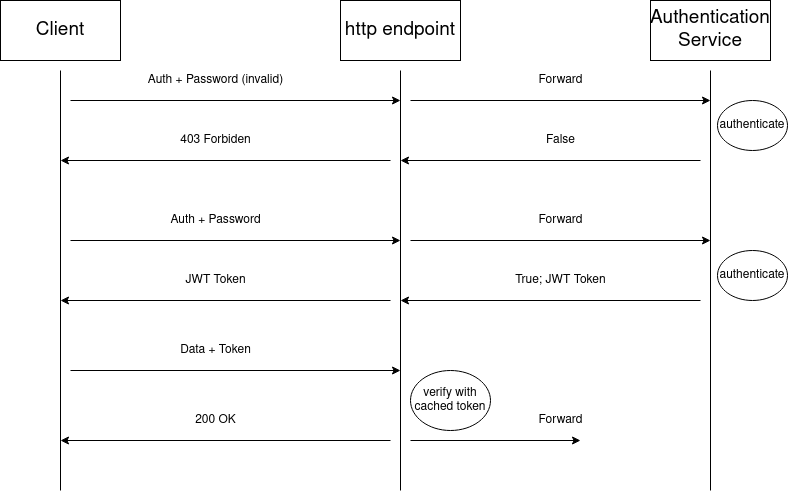

# Authentication service

## Overview

Use a token based system for the authentication of devices. The authentication service can support multiples authentication mechanisms and hands out a token if authentication is sucessfull. 
In order to avoid the authentication process for each message, the token have a limited *validity period* and are cached by the adapters. 
Subsequent requests from the devices contains the token. 

## Technologies

### Token
JWT seems to be a good fit for that process. Since it's a simple JSON object it can be easily extended to integrate with an authorization service later down the road.

### Credentials persistence
Credentials needs to be stored in a long-running instance. SQL databases are proven and fit the use case. [Diesel](https://github.com/diesel-rs/diesel) seems to be a nice querry builder for rust. 
As we want to build "iot platform as a service" it is reasonnable to have a limited selection of database compatibilty. Diesel is compatible with postgre, mysql and sqlite. 

### Token caching in adapters
In memory hasmap ? 

